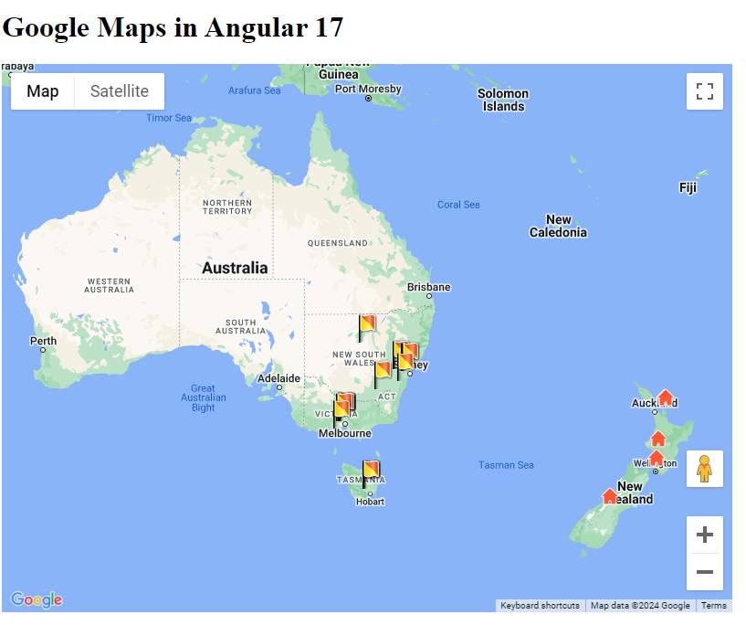

# Integrating Google Maps in Angular 17



Since the default Google Map Marker has been _deprecated as of February 21, 2024_, this repository makes use of the new **Advanced Map Markers** and Angular's official Google Maps [component](https://github.com/angular/components/blob/main/src/google-maps/README.md) and [package](https://www.npmjs.com/package/@angular/google-maps) to integrate Google Maps in an Angular 17 application.

Please refer to this [Medium article](https://medium.com/@selsa-pingardi/integrating-google-maps-in-angular-17-66487ed2238c) for a full rundown and step-by-step instruction on how to implement a Google Map with Advanced Map Markers.

## Project Setup

### Prerequisites

Make sure you have the latest and compatible version of npm, Angular v17 and Node installed. In this example, I used:
| Angular | Node.JS | NPM |
| -------- | -------- | ------- |
| v17.3.2 | v20.11.1 | v10.2.4 |

To check your versions simply run:

```
ng v
```

### Installation

1. Clone this repository

   ```
   git clone https://github.com/selsapingardi/angular-google-maps.git
   cd angular-google-maps
   ```

2. Install the necessary packages
   ```
   npm i
   ```

## Running the Project

1. Change the **API key** in the `src/index.html` file with your own.

2. Run the application

   ```
   ng serve
   ```

3. Navigate to `http://localhost:4200/` to view the project and watch it update every time a change is made to the source files.
